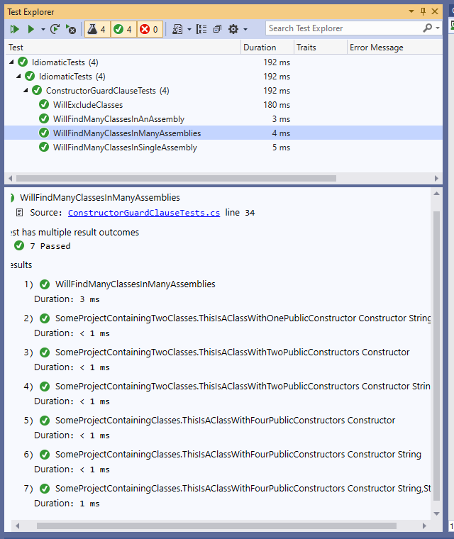

# Data Driven Idioms
Create a data driven test result for each AutoFixture GuardClause Constructor test. 

Implements ITestDataSource to discover the types and name the test results. 

So the results look like:

## TODO
Unit test DataSource
